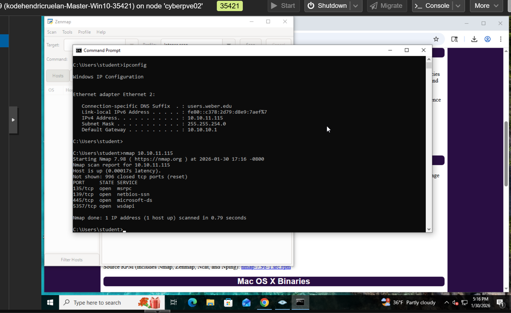
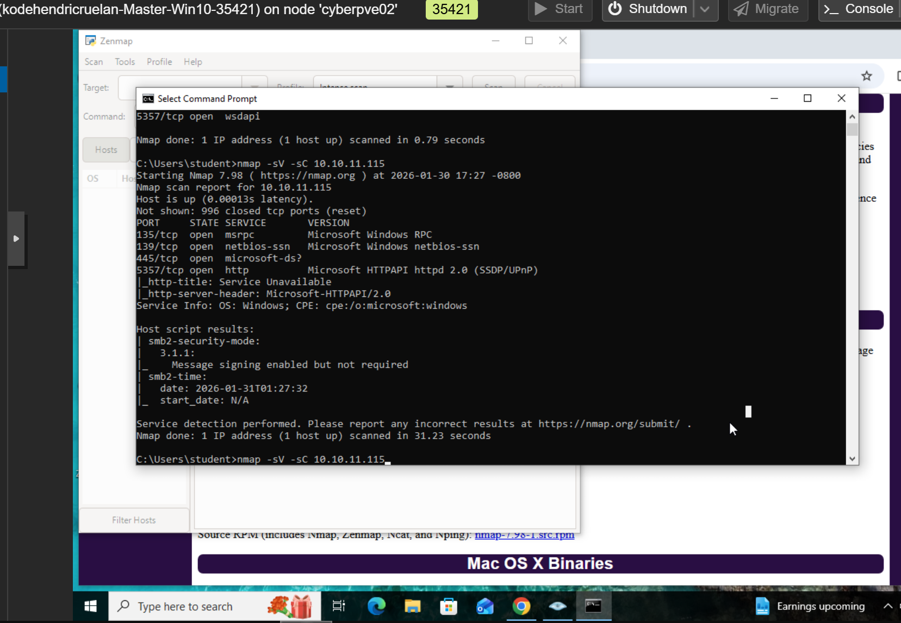
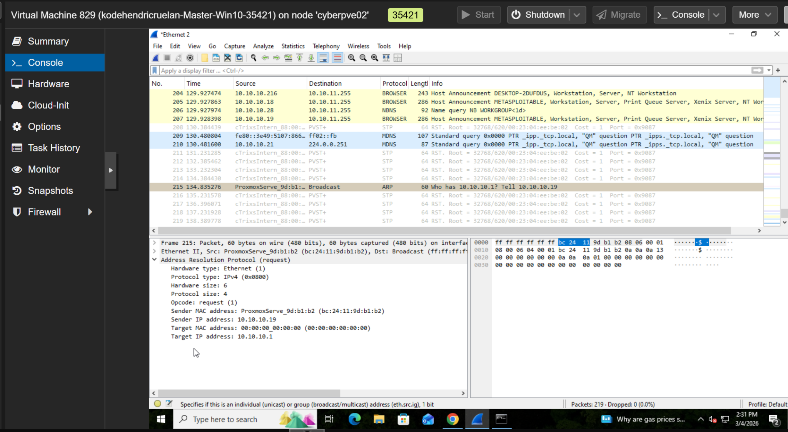
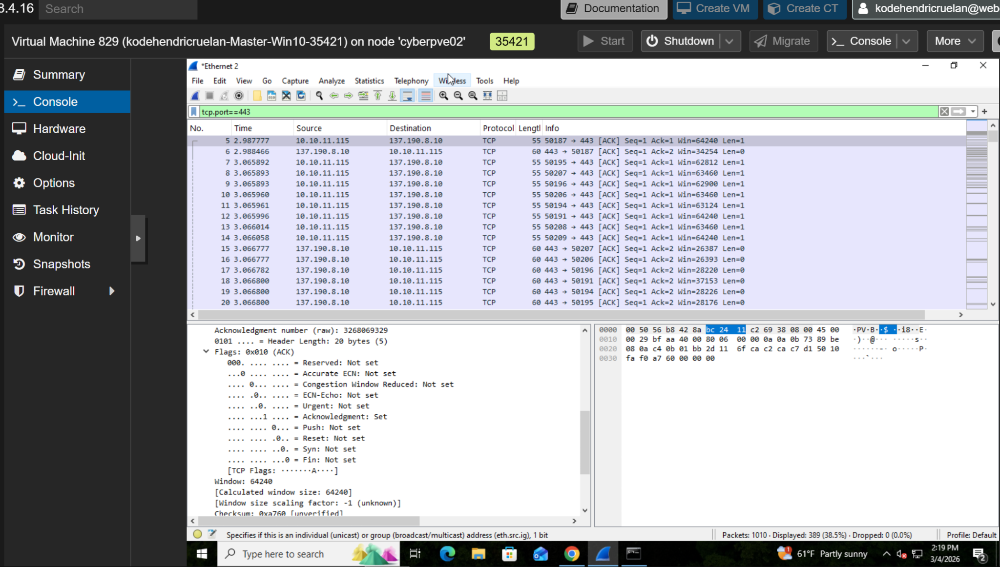
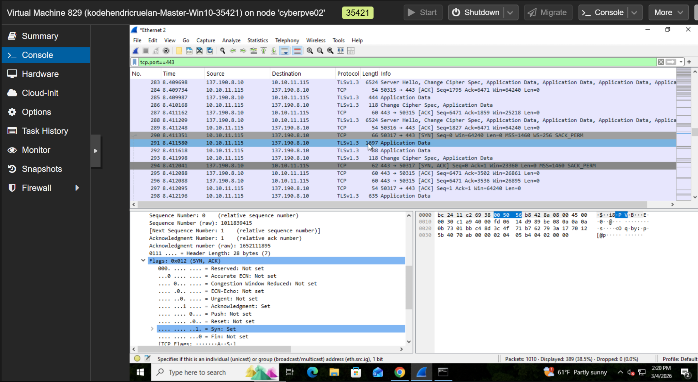
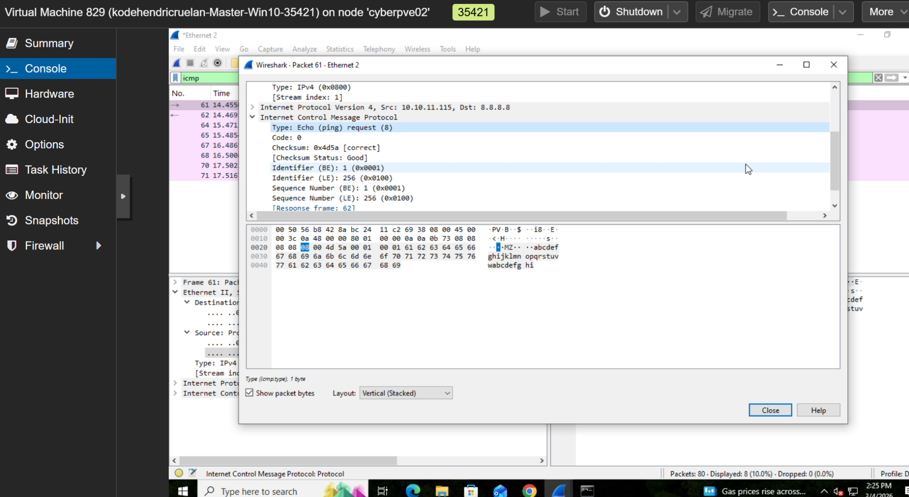
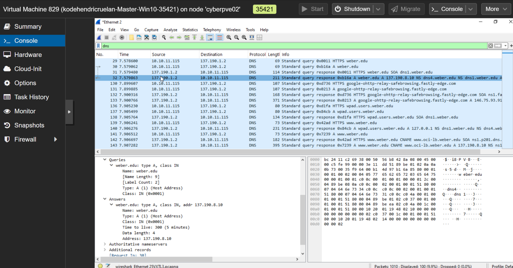
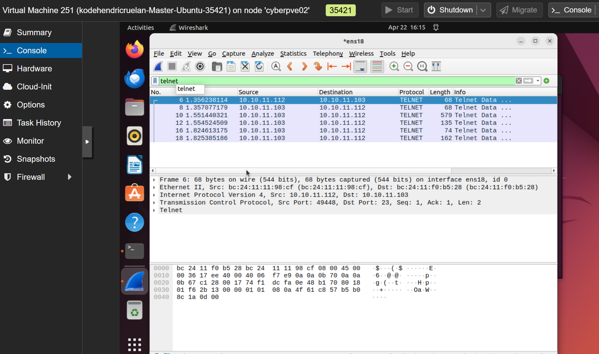
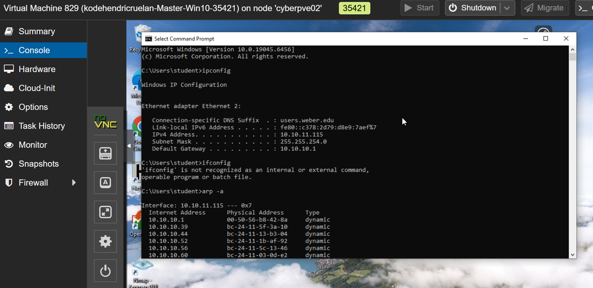

# network-traffic-analysis
Hands-on network traffic analysis using Wireshark to investigate DNS, TCP, TLS, ICMP, and ARP protocols in a virtual lab.

# Network Traffic Analysis with Wireshark

## Overview
This project documents hands-on network traffic analysis using Wireshark in a virtual lab environment. The goal was to better understand common network protocols, inspect packet-level communication, and identify how different types of traffic appear during normal network activity.

## Lab Environment
- Windows virtual machine
- Wireshark
- Virtualized network environment
- Command Prompt and networking utilities

## Objectives
- Capture and filter network traffic
- Analyze DNS queries and responses
- Identify the TCP three-way handshake
- Examine HTTPS/TLS communication
- Investigate ICMP and ARP packets

## Lab Activities

### 1. DNS Analysis
Captured and filtered DNS traffic to examine how a client requests domain-name resolution and receives a response.

### 2. TCP Analysis
Examined TCP SYN, SYN-ACK, and ACK flags to understand how a TCP connection is established.

### 3. HTTPS and TLS
Inspected traffic on TCP port 443 and observed encrypted TLS communication.

### 4. ICMP Analysis
Reviewed ICMP echo requests and replies to understand basic connectivity testing.

### 5. ARP Analysis
Examined ARP traffic to understand how devices resolve IPv4 addresses to MAC addresses on a local network.

## Screenshots

### 1. Nmap Port Scan

### 2. Nmap Service Version Detection

### 3. DNS Query

### 4. DNS Response

### 5. TCP and TLS Analysis

### 6. ICMP Ping Analysis

### 7. ARP Request Analysis

### 8. Telnet Packet Analysis

### 9. Linux ARP Table

## Key Takeaways
- Developed familiarity with Wireshark packet capture and filtering
- Improved understanding of common network protocols
- Practiced identifying packet fields and communication patterns
- Learned how packet analysis supports network troubleshooting and security investigations

## Disclaimer
All activities were performed in a controlled educational lab environment.
